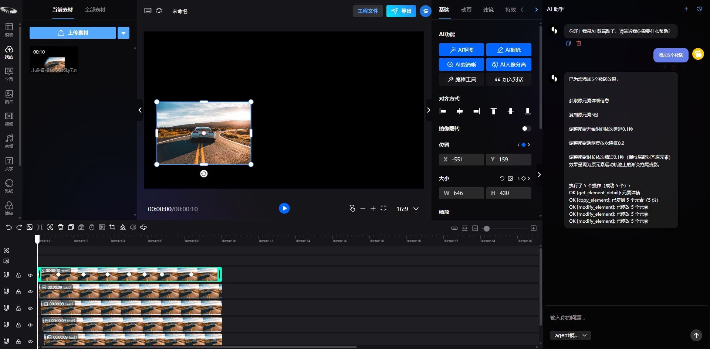

<div align="center">
  <h1>UNICUT · 无界云剪</h1>

  <p><strong>AI 驱动的开源 Web 视频编辑器</strong></p>
  <p>把多轨剪辑、动画特效、智能处理与 AI 创作带进浏览器，让视频生产无需安装、打开即用。</p>

  <p>
    <a href="https://unicut.h5ds.com/"><strong>在线体验</strong></a>
    ·
    <a href="#-核心能力">核心能力</a>
    ·
    <a href="#-快速开始">快速开始</a>
    ·
    <a href="#-二次开发与集成">二次开发</a>
    ·
    <a href="#-参与共建">参与共建</a>
  </p>

  <p>
    <a href="https://github.com/mtsee/unicut/stargazers"></a>
    <a href="https://github.com/mtsee/unicut/network/members"></a>
    <a href="https://github.com/mtsee/unicut/issues"></a>
    
    
    
  </p>
</div>


## 🌐 在线体验

无需下载安装，也无需准备开发环境，使用桌面浏览器即可进入 UNICUT：

### [立即体验 UNICUT → https://unicut.h5ds.com/](https://unicut.h5ds.com/)

建议使用最新版 Chrome 或 Edge。首次创建本地项目时，请根据页面提示选择一个文件夹并授予读写权限，随后即可导入素材，体验多轨时间轴、画布编辑、动画、滤镜、特效、字幕和视频导出等流程。

> [!NOTE]
> AI 对话、AI 生图 / 生视频、语音和云端合成等在线能力可能需要登录、网络连接或相应服务额度。

## ✨ 关于 UNICUT

UNICUT（无界云剪）是一款面向创作者、开发者与企业团队的在线视频编辑器。项目以剪映 / CapCut 一类产品的创作工作流为参照，将桌面剪辑软件常见的多轨时间轴、关键帧、转场、字幕、抠图、音视频处理和实时特效带到 Web 端，并进一步加入 AI Agent、生成式 AI 与浏览器端视觉模型。

这不是一个只能演示“裁剪 + 拼接”的概念项目。当前仓库已经包含完整的编辑器界面、实时画布、素材与属性面板、多轨时间轴、项目工作区、本地文件存储、媒体 Worker 和导出流程，可直接用于学习、体验，也可作为行业视频工具和企业内容平台的开发基础。

微信群：


### 适合谁使用

| 角色 | 可以用 UNICUT 做什么 |
| --- | --- |
| 内容创作者 | 在浏览器中完成短视频、宣传片、课程、口播和社交媒体内容制作 |
| 前端 / 音视频开发者 | 学习 WebGL 渲染、Web 音视频处理、复杂时间轴与浏览器 AI 工程实践 |
| 企业研发团队 | 快速搭建内部剪辑平台、品牌内容工具、模板化生产系统或行业解决方案 |
| 生态开发者 | 扩展素材源、业务面板、自定义元素、特效、模板和 AI 工作流 |

## 🚀 核心价值

| 核心价值 | 说明 |
| --- | --- |
| 浏览器即用 | 无需安装大型桌面客户端，在线体验地址打开即可创作 |
| 完整剪辑链路 | 从素材导入、画布编排、多轨剪辑到视频导出形成闭环 |
| 实时视觉编辑 | 基于 PixiJS / WebGL 的所见即所得画布，操作结果即时反馈 |
| AI 深度融入 | AI 不仅生成素材，还能理解自然语言并直接操作编辑器 |
| 本地数据能力 | 工程和素材可保存到用户授权的本地文件夹，元数据由 IndexedDB 管理 |
| 面向业务扩展 | 支持注入 API、品牌配置、自定义侧边栏、资源地址和编辑器插件 |

## 🎬 核心能力

### 多轨时间轴与画布

- 视频、图片、音频、文字、字幕、贴纸、特效等多类型轨道混合编排；
- 拖拽、拉伸、分割、复制、删除、多选、批量移动和轨道排序；
- 视频帧缩略图、音频波形、时间刻度、吸附对齐和时间轴缩放；
- 轨道隐藏与锁定、撤销与重做、键盘快捷键；
- 冻结帧、提取音频、画面裁剪、时间裁剪、静音和封面设置；
- 在画布中直接移动、缩放、旋转、多选和调整图层关系。

### 元素、动画与视觉效果

| 类别 | 能力 |
| --- | --- |
| 视频 | 裁剪、分割、调色、变速、抠图、静音、音频分离、帧预览 |
| 图片 | 常见静态图片、GIF / APNG、滤镜、动画、裁剪与特效 |
| 文字 / 花字 | 字体、字号、描边、阴影、渐变、排版与逐字动画 |
| 音频 | 音量、淡入淡出、变速、波形、录音与 TTS |
| 字幕 | 独立字幕轨道、样式编辑、手动打轴与语音识别生成 |
| Lottie 贴纸 | Lottie JSON 动画、播放速度和循环模式 |
| 转场 | 多种 GL Transitions 过渡效果与时长控制 |
| 滤镜 / 特效 | LUT、基础调色、图层混合和 WebGL 实时效果 |
| 镜头 / 机位 | 多视角组织与镜头切换 |
| 二维码 | 内容、颜色、尺寸和容错级别配置 |
| 图表 | 基于 ECharts 的图表元素，目前仍在持续完善 |

动画系统支持入场、出场、强调、逐字、Lottie、转场和自定义关键帧动画。元素的位置、缩放、旋转、透明度等属性均可参与动画，并可通过贝塞尔曲线或直线路径创建自定义运动轨迹。

视觉处理覆盖基础调色、LUT 滤镜、图层混合、边框、阴影、渐变、绿幕 / 蓝幕抠像、形状蒙版、视频曲线变速以及多种 PixiJS / WebGL 实时特效。

### 抠图与智能处理

- 钢笔路径抠图与魔棒相似色选区；
- 常规画面裁剪与形状蒙版；
- AI 主体抠图与人像分离；
- AI 智能擦除与图像超分辨率；
- 视频目标轨迹追踪。

### 素材、工程与导出

- 视频、图片、音频、文字、贴纸、滤镜、特效、转场、字幕和模板分类；
- 本地批量导入、拖拽添加、悬停预览、搜索和收藏；
- 浏览器内录音、从视频提取音频、二维码扫码上传；
- 新建、保存、另存为、复制、移动和删除工程；
- 草稿、素材、模板和导出作品工作区；
- 截取当前帧作为海报或视频封面；
- 按分辨率、帧率等参数在浏览器本地导出，也可对接云端合成服务。

## 🤖 AI：从生成素材到直接剪辑

UNICUT 将 AI 放进真实编辑流程，而不是把它作为一个孤立的生成入口。

### AI Agent：用自然语言操作编辑器

你可以直接向编辑器下达指令：

```text
在 3 秒的位置剪一刀
把选中的文字改成「Hello UNICUT」
复制这个元素 5 份，开始时间依次增加 0.2 秒
删除 2 到 5 秒之间的所有元素
给这个元素添加一段抖动动画
把这些元素的开始时间对齐
```

当前 Agent 已接入近 30 个底层编辑工具，覆盖元素查询与增删改、播放控制、时间定位、字幕管理、关键帧、动画、分割、复制、移动、轨道布局和批量时间段操作。AI 可以把复杂指令拆解为一系列编辑动作，减少重复、机械的时间轴操作。



### AI 能力矩阵

| 场景 | 能力 |
| --- | --- |
| 自然语言剪辑 | AI Agent 调用编辑器工具，直接修改元素、时间轴、字幕与动画 |
| 图片生成 | 文生图、图生图、多图参考生成 |
| 视频生成 | 文生视频、图生视频、首帧 / 首尾帧生视频 |
| 音频与字幕 | 语音识别字幕、文字转语音、多音色配音 |
| 浏览器端视觉处理 | 人像分离、主体抠图、智能擦除、图像超分辨率 |
| 智能编辑 | 素材分析、自动化编辑流程、视频目标跟踪 |

> [!IMPORTANT]
> 仓库同时包含浏览器本地能力与在线服务接入。部分视觉模型和素材处理可直接在浏览器中执行；账号、在线素材、AI 对话、生成式 AI、语音服务和云端合成等功能需要相应 API、模型服务或额度支持。

## 🧰 技术实现

UNICUT 采用 React + TypeScript 构建编辑器界面与业务层，通过 MobX 管理复杂编辑状态；画布由 PixiJS / WebGL 实时渲染，音视频解码、处理和导出由 Web Worker、FFmpeg WebAssembly、MediaBunny 等能力协同完成。素材文件可写入用户授权的本地目录，工程元数据和文件句柄通过 Dexie / IndexedDB 管理。

### 主要技术栈

| 领域 | 技术 |
| --- | --- |
| 前端工程 | React 18、TypeScript、Vite |
| UI 与状态 | Semi Design、MobX、Less |
| 画布与特效 | PixiJS、WebGL、Three.js、GL Transitions |
| 音视频处理 | FFmpeg WebAssembly、MediaBunny、MP4 Muxer、Howler、Web Worker |
| 浏览器 AI | MediaPipe Tasks Vision、ONNX Runtime Web、OpenCV、Tesseract |
| 本地数据 | File System Access API、IndexedDB、Dexie |
| 内容能力 | Lottie、ECharts、GIF / APNG、JSZip、XLSX |

## 🛠 快速开始

### 环境准备

- Git；
- Node.js 18+，推荐使用当前 LTS 版本；
- Yarn Classic；
- 最新版 Chrome 或 Edge。

File System Access API、部分 WebCodecs / WebGL 能力和本地 AI 推理依赖现代浏览器。开发环境请通过 `localhost` 或 HTTPS 访问，不建议直接双击 `index.html`。

### 获取代码并启动

```bash
git clone https://github.com/mtsee/unicut.git
cd unicut
yarn install
yarn dev
```

Vite 默认监听 `3005` 端口。请以终端实际输出为准，在浏览器中访问：

```text
https://localhost:3005
```

首次进入本地工作区时，浏览器会请求选择一个文件夹，用于保存素材和工程数据。请授予读写权限；后续可以在浏览器设置中撤销授权。

### 构建与预览

```bash
yarn build
yarn preview
```

构建产物位于 `dist/`，预览服务默认使用 `8080` 端口。

## ⚙️ 能力边界与私有化说明

当前仓库主要包含编辑器前端、浏览器媒体处理、本地工程 / 素材存储，以及在线服务的客户端接入层。为了帮助二次开发者准确评估接入成本，各类能力的默认边界如下：

| 能力 | 默认实现 |
| --- | --- |
| 画布、时间轴、属性编辑 | 浏览器前端与 `video-core-sdk` |
| 本地素材与工程 | File System Access API + IndexedDB |
| 本地媒体处理与导出 | Web Worker + 浏览器媒体能力 + FFmpeg WebAssembly |
| 浏览器端视觉模型 | 仓库内置模型资源与前端推理逻辑 |
| 账号、官方素材与任务中心 | 依赖在线服务接口 |
| AI 对话、生成式 AI、语音服务 | 依赖对应模型和服务端 API |
| 云端视频合成 | 依赖单独的渲染与任务服务 |

开发服务器已为 `/api` 和 `/cgi-bin` 配置代理，默认连接 UNICUT 在线服务。私有化部署时，可以替换 `src/config/index.ts` 中的 API、资源域名和 Worker 地址，并根据 `APIServer` 类型接入自己的项目、素材、上传、AI 与导出服务。

如果只研究编辑器或本地处理能力，可以先从本地存储模式开始，不必一次接入全部在线服务。请勿把服务密钥、访问令牌或真实账号数据提交到仓库。

## 🧩 二次开发与集成

编辑器预留了多种注入点，适合企业集成、品牌定制与行业扩展：

| 配置项 | 用途 |
| --- | --- |
| `apiServer` | 接入自己的项目、素材、上传、AI 与导出服务 |
| `plugins` | 注册自定义编辑器元素和渲染能力 |
| `sides` | 增加自定义侧边栏入口和业务面板 |
| `resourcesHost` | 替换素材与公共资源域名 |
| `workerPath` | 指定媒体解码 Worker 地址 |
| `exConfig` | 控制 Logo、语言、项目按钮和品牌交互 |
| `movieData` / `appid` | 通过工程 JSON 或业务项目 ID 加载编辑器 |
| `saveAppCallback` | 保存后衔接企业内部工作流 |

仓库内置的二维码元素是一个可参考的插件实现：

```text
src/pages/editor/plugins/qrcode
```

## 📁 目录结构

```text
unicut/
├── docs/                         # 功能说明、产品文章与截图
├── public/
│   ├── assets/                   # FFmpeg、AI 模型、滤镜、蒙版等运行资源
│   └── worker/                   # 音视频解码 Worker
├── src/
│   ├── components/               # 通用组件
│   ├── config/                   # 运行配置与编辑器 SDK 类型
│   ├── database/                 # IndexedDB 数据结构
│   ├── language/                 # 中英文国际化
│   ├── layout/                   # 首页、用户、工作区和编辑器布局
│   ├── pages/
│   │   ├── editor/
│   │   │   ├── components/
│   │   │   │   ├── ai-chat/      # AI Agent
│   │   │   │   ├── canvas/       # 实时画布与播放器
│   │   │   │   ├── options/      # 元素属性、动画、滤镜和蒙版
│   │   │   │   ├── sources/      # 素材与 AI 面板
│   │   │   │   └── timeline2/    # 多轨时间轴与编辑工具
│   │   │   └── plugins/          # 编辑器插件
│   │   ├── home/                 # 产品首页
│   │   ├── user/                 # 账号与消息
│   │   └── workspace/            # 草稿、素材和作品管理
│   ├── server/                   # API 客户端基础层
│   ├── services/                 # 本地文件与工程服务
│   ├── stores/                   # MobX 状态
│   ├── theme/                    # 明暗主题
│   └── utils/                    # 导出、鉴权、事件与通用工具
├── package.json
└── vite.config.ts
```

## 🌍 浏览器与媒体兼容性

- 推荐使用最新版桌面 Chrome；Edge 同样支持本地文件夹访问；
- 移动端更适合预览和上传素材，完整剪辑建议使用桌面浏览器；
- 媒体格式兼容性受浏览器解码器、WebCodecs 和 FFmpeg WebAssembly 支持情况影响；
- 遇到素材无法解码时，建议先转换为 H.264 + AAC 编码的 MP4 或常见 Web 格式；
- 大分辨率、长时长、多图层与复杂 AI 任务会占用较多内存和 GPU 资源。

## 🗺️ 欢迎共建的方向

- 完善图表元素与更多数据可视化模板；
- 扩展特效、转场、Lottie、滤镜和行业模板；
- 增加编辑器插件示例与开发文档；
- 完善私有化 API 接入说明；
- 提升大工程性能、稳定性与浏览器兼容性；
- 补充单元测试、端到端测试、无障碍与国际化；
- 改进 AI Agent 工具、提示词和可复用自动化流程。

## 🤝 参与共建

我们欢迎 Bug 修复、功能建议、性能优化、文档完善、设计改进，以及新的插件、素材和 AI 能力。

1. Fork 本仓库，并从 `main` 创建功能分支；
2. 保持改动聚焦，必要时补充测试或复现步骤；
3. 前端改动请附截图或录屏，说明浏览器和测试素材；
4. 提交前运行 `yarn build`，并确认没有提交密钥、账号数据或未获许可的素材；
5. 发起 Pull Request，清楚描述问题、方案和影响范围。

提交 [GitHub Issue](https://github.com/mtsee/unicut/issues) 时，请尽量附上：

- 浏览器与操作系统版本；
- 可复现的最小工程或素材信息；
- 操作步骤、期望行为与实际行为；
- 控制台错误、截图或录屏。

如果 UNICUT 对你有帮助，欢迎点亮 Star、分享给更多创作者，或认领一个你感兴趣的 Issue。

## ❓ 常见问题

<details>
<summary><strong>UNICUT 可以完全离线使用吗？</strong></summary>

本地工程、素材管理以及部分浏览器端媒体 / AI 处理能力可以在本地运行；在线素材、账号、AI 对话、生成式 AI、语音服务和云端合成等能力仍需要网络及对应服务。
</details>

<details>
<summary><strong>可以部署到自己的服务器吗？</strong></summary>

可以部署前端并进行二次开发。若要提供完整的平台能力，需要自行实现或接入项目、素材、用户、AI 和渲染等服务端接口。
</details>

<details>
<summary><strong>素材会自动上传吗？</strong></summary>

本地存储模式下，工程和素材保存在用户授权的本地文件夹中。当你主动使用在线素材、云端 AI、语音识别、生成或云合成等能力时，相关数据可能需要发送到对应服务。私有化部署方应根据自己的服务实现提供清晰的隐私说明。
</details>

<details>
<summary><strong>为什么推荐 Chrome / Edge？</strong></summary>

本地文件夹读写依赖 File System Access API，部分媒体处理和 AI 推理也依赖较新的 WebGL、WebAssembly、WebCodecs 或 WebGPU 能力。Chromium 系浏览器目前能提供更完整、稳定的体验。
</details>

## 🔗 相关链接

- 在线体验：[https://unicut.h5ds.com/](https://unicut.h5ds.com/)
- GitHub：[https://github.com/mtsee/unicut](https://github.com/mtsee/unicut)
- Gitee 镜像：[https://gitee.com/676015863/unicut](https://gitee.com/676015863/unicut)
- 完整功能清单：[docs/功能清单.md](./docs/功能清单.md)

## 📜 开源协议与授权说明

UNICUT 使用基于 Apache License 2.0 修改的**项目专属开源协议**，不是未经修改的标准 Apache 2.0 许可证。除 Apache 2.0 的一般条款外，仓库协议还包含额外条件，包括但不限于：

- 未经书面授权，不得使用 UNICUT 源码运营多租户环境；
- 使用 UNICUT 前端时，不得移除或修改产品 Logo 与版权信息；
- 符合协议所述条件的场景需要获得商业授权；
- 产品交互设计受外观专利保护；
- 贡献代码可能被项目方用于商业用途。

### [阅读完整协议文件 → LICENSE](./LICENSE)

> [!WARNING]
> 下载、使用、部署、二次开发或贡献代码，即表示你需要遵守仓库中的完整协议。用于生产、商用、SaaS、多租户或品牌定制前，请务必先阅读协议；如有疑问，请通过项目仓库联系维护者确认授权边界。

---

<div align="center">
  <p><strong>让专业视频创作留在浏览器，也让每个人都能参与塑造下一代开源剪辑工具。</strong></p>
  <p>Made with creativity by the UNICUT community.</p>
</div>
