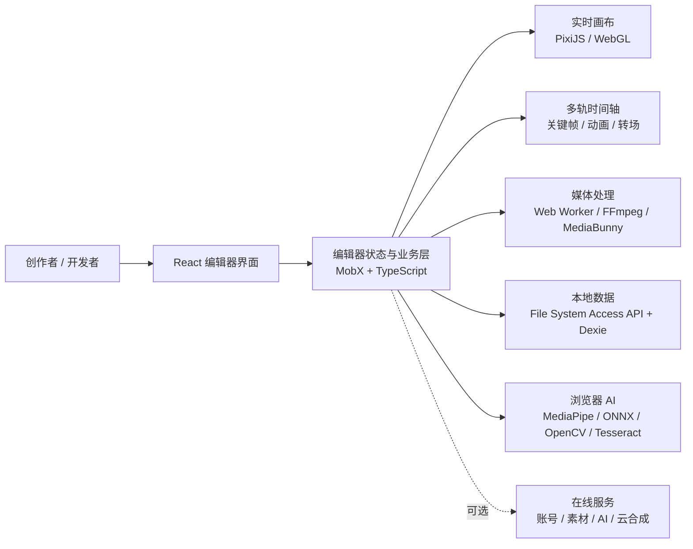

<div align="center">
  

  <h1>UNICUT · 无界云剪</h1>

  <p><strong>AI 驱动的开源 Web 视频编辑器</strong></p>
  <p>无需安装，打开浏览器即可完成从素材管理、多轨剪辑、动画特效到 AI 创作与视频导出的完整工作流。</p>

  <p>
    <a href="https://unicut.h5ds.com/"><strong>在线体验</strong></a>
    ·
    <a href="#-快速开始">本地运行</a>
    ·
    <a href="#-功能全景">功能全景</a>
    ·
    <a href="./LICENSE">开源协议</a>
    ·
    <a href="#-参与共建">参与共建</a>
  </p>

  <p>
    <a href="https://github.com/mtsee/unicut/stargazers"></a>
    <a href="https://github.com/mtsee/unicut/network/members"></a>
    <a href="https://github.com/mtsee/unicut/issues"></a>
    <a href="./LICENSE"></a>
    
    
  </p>
</div>


## 🌐 在线体验

无需下载安装，也无需配置开发环境，打开浏览器即可体验 UNICUT 的完整创作界面：

### [立即体验 UNICUT → https://unicut.h5ds.com/](https://unicut.h5ds.com/)

- 推荐使用最新版 Chrome 或 Edge，并通过桌面端浏览器访问；
- 首次创建本地项目时，请按页面提示选择一个文件夹并授予读写权限；
- 你可以体验素材导入、多轨时间轴、画布编辑、动画、滤镜、特效、字幕和视频导出等核心流程；
- AI 对话、AI 生图 / 生视频、语音和云端合成等在线能力可能需要登录、网络连接或相应额度。

> [!NOTE]
> 在线体验站用于快速了解产品能力。准备二次开发或私有化部署时，请继续阅读下方的[快速开始](#-快速开始)与“本地运行和完整平台能力”章节。

## 📄 专属开源协议

UNICUT 使用基于 Apache License 2.0 修改的**项目专属开源协议**，包含多租户服务、产品 Logo 与版权信息、商业授权以及代码贡献等附加条款，并非未经修改的标准 Apache License 2.0。

### [查看 UNICUT 完整开源协议 → LICENSE](./LICENSE)

> [!WARNING]
> 下载、使用、部署、二次开发或贡献代码，即表示你需要遵守仓库中的完整协议。用于生产、商用、SaaS、多租户或品牌定制前，请务必先阅读协议；多租户服务和移除或修改前端 Logo、版权信息等场景需要获得相应授权。

## ✨ 项目简介

UNICUT（无界云剪）是一款面向创作者、开发者与企业团队的在线视频编辑器。项目以剪映 / CapCut 一类产品的创作体验为参照，把桌面剪辑软件常见的多轨时间轴、关键帧、滤镜、转场、字幕、抠图和音视频处理能力带到浏览器中，并进一步加入 AI Agent、AI 生图、生视频、智能字幕和浏览器端视觉模型。

它不是一个只能演示“裁剪 + 拼接”的原型。当前仓库已经包含完整的编辑器界面、画布渲染、素材面板、属性面板、时间轴、项目工作区、本地存储、Web Worker 解码与导出等模块，可以作为：

- 一款打开即用的在线视频创作工具；
- 学习 Web 音视频、WebGL、浏览器 AI 与复杂前端工程的实战项目；
- 企业内部视频生产平台、行业剪辑工具或模板化内容系统的二次开发基础；
- 自定义素材库、AI 工作流、品牌模板和编辑器插件的承载平台。

> [!TIP]
> 想先感受实际效果？访问 [unicut.h5ds.com](https://unicut.h5ds.com/)。推荐使用最新版 Chrome 或 Edge。

## 🚀 为什么选择 UNICUT

| 能力 | UNICUT 带来的价值 |
| --- | --- |
| 浏览器即用 | 无需安装大型桌面客户端，访问页面即可开始创作 |
| 专业剪辑工作流 | 多轨时间轴、帧图与波形预览、关键帧、转场、变速、字幕、撤销重做一应俱全 |
| 所见即所得 | 基于 PixiJS / WebGL 的实时画布，拖拽、缩放、旋转、调色和特效即时反馈 |
| AI 深度融入 | 不止生成素材，还能通过自然语言调用编辑器工具，直接修改时间轴和画面元素 |
| 本地数据能力 | 素材与工程可保存到用户选择的本地文件夹，元数据由 IndexedDB 管理 |
| 面向扩展 | 支持自定义侧边栏、API Server、品牌配置、素材源和编辑器插件 |
| 开源可研究 | React + TypeScript + Vite 技术栈，核心业务模块与完整 UI 均可阅读和二次开发 |

## 🎬 功能全景

### 专业时间轴

- 多轨道视频、图片、音频、文字、字幕、贴纸与特效叠加；
- 素材拖拽、拉伸、分割、复制、删除、批量选择与移动；
- 视频帧缩略图与音频波形预览；
- 轨道隐藏、锁定、吸附、排序与时间轴缩放；
- 冻结帧、提取音频、画面裁剪、时间裁剪和封面设置；
- 完整的撤销 / 重做与键盘快捷键；
- 精确到属性的关键帧编辑和动画轨迹控制。

### 丰富的画面元素

| 类型 | 主要能力 |
| --- | --- |
| 视频 | 裁剪、分割、变速、调色、抠图、静音、音频分离、帧预览 |
| 图片 | 常见静态格式、GIF / APNG、滤镜、动画、裁剪与特效 |
| 文字 / 花字 | 字体、描边、阴影、渐变、排版、逐字动画和预设样式 |
| 音频 | 音量、淡入淡出、变速、波形、录音和 TTS |
| 字幕 | 手动编辑、独立字幕轨道、AI 语音识别生成 |
| Lottie 贴纸 | JSON 动画、速度与循环控制 |
| 滤镜 / 特效 | LUT、基础调色、WebGL 特效与强度调节 |
| 转场 | 基于 GL Transitions 的多种镜头过渡与时长控制 |
| 镜头 / 机位 | 多视角组织与镜头切换 |
| 二维码 | 内容、颜色、尺寸和容错级别配置 |
| 图表 | 基于 ECharts 的图表元素，仍在持续完善 |

### 动画与视觉效果

- 入场、出场、强调和自定义关键帧动画；
- 贝塞尔曲线与直线运动路径；
- 逐字动画、Lottie 动画、转场动画和遮罩动画；
- 位移、缩放、旋转、透明度、镜像翻转；
- 亮度、对比度、饱和度、色温、曝光等基础调色；
- LUT 滤镜、图层混合模式、边框、阴影和渐变色；
- 绿幕 / 蓝幕抠像、形状蒙版与边缘参数调节；
- 视频和音频匀速变速、视频曲线变速；
- 数十种 PixiJS / WebGL 实时视觉效果。

### 多种抠图与智能处理工具

- 钢笔路径抠图；
- 魔棒相似色选区；
- AI 主体抠图；
- AI 人像分离；
- AI 智能擦除；
- AI 图像超分辨率；
- 视频目标轨迹追踪；
- 常规画面裁剪。

### 素材与项目管理

- 视频、图片、音频、文字、贴纸、滤镜、特效、转场、字幕和模板分类；
- 本地批量导入、拖拽添加、悬停预览、搜索和收藏；
- 浏览器内录音、从视频提取音频、二维码扫码上传；
- 新建、保存、另存为、复制和删除工程；
- 草稿、素材、模板与导出作品工作区；
- 截取当前画面生成海报或视频封面；
- 自定义分辨率、帧率等导出参数。

## 🤖 AI 不只是“生成”，还能直接剪辑

UNICUT 将 AI 能力放进真实编辑流程，而不是单独做一个生成入口。

### AI Agent：用自然语言操作编辑器

你可以直接告诉编辑器：

```text
在 3 秒的位置剪一刀
把选中的文字改成「Hello UNICUT」
复制这个元素 5 份，开始时间依次增加 0.2 秒
删除 2 到 5 秒之间的所有元素
给这个元素添加一段抖动动画
把这些元素的开始时间对齐
```

当前 Agent 已接入近 30 个底层编辑工具，覆盖元素查询与增删改、播放控制、时间定位、字幕管理、关键帧、动画、分割、复制、移动、轨道布局与批量时间段操作。复杂的机械步骤可以由 AI 一次编排完成，创作者把时间留给内容和节奏。


### AI 创作与浏览器端智能能力

| 类别 | 能力 |
| --- | --- |
| 生成式创作 | 文生图、图生图、文生视频、图生视频、首尾帧生视频 |
| 音频与字幕 | 语音自动生成字幕、文字转语音、多音色配音 |
| 智能编辑 | 素材内容识别、自动剪辑、视频目标跟踪 |
| 浏览器端视觉处理 | 人像分离、主体抠图、智能擦除、图像超分辨率 |

> [!IMPORTANT]
> 仓库同时包含本地能力和在线服务能力。部分视觉模型及素材处理可直接在浏览器中执行；账号、在线素材、AI 对话、生成式 AI、语音服务和云端合成等功能需要相应 API、模型服务或额度支持。在线体验站的计费规则不等同于开源许可证。

## 🧱 技术架构



### 主要技术栈

| 领域 | 技术 |
| --- | --- |
| 前端框架 | React 18、TypeScript、Vite |
| UI 与状态 | Semi Design、MobX、Less |
| 画布与特效 | PixiJS、WebGL、Three.js、GL Transitions |
| 音视频处理 | FFmpeg WebAssembly、MediaBunny、MP4 Muxer、Howler、Web Worker |
| 浏览器 AI | MediaPipe Tasks Vision、ONNX Runtime Web、OpenCV、Tesseract |
| 本地数据 | File System Access API、IndexedDB、Dexie |
| 其他能力 | Lottie、ECharts、GIF / APNG、JSZip、XLSX |

## 🛠 快速开始

### 环境建议

- Git；
- Node.js 18+（推荐使用当前 LTS 版本）；
- Yarn Classic；
- 最新版 Chrome 或 Edge。

File System Access API、部分 WebCodecs / WebGL 能力和本地 AI 推理依赖现代浏览器。开发环境请通过 `localhost` 或 HTTPS 访问，不建议直接双击 `index.html`。

### 1. 获取代码

```bash
git clone https://github.com/mtsee/unicut.git
cd unicut
```

### 2. 安装依赖

```bash
yarn install
```

### 3. 启动开发环境

```bash
yarn dev
```

Vite 默认监听 `3005` 端口。请以终端输出为准，在浏览器中访问：

```text
https://localhost:3005
```

首次进入本地工作区时，浏览器会请求选择一个文件夹，用于保存素材和项目数据。请授予读写权限；后续仍可在浏览器中撤销授权。

### 4. 构建与预览

```bash
yarn build
yarn preview
```

构建产物位于 `dist/`，预览服务默认使用 `8080` 端口。

## ⚙️ 本地运行与完整平台能力

这个仓库主要包含编辑器前端、浏览器媒体处理、本地项目 / 素材存储以及在线服务的客户端接入层。

- 本地编辑模式会把素材文件保存到用户授权的文件夹，并用 IndexedDB 管理文件句柄和工程元数据；
- 开发服务器已为 `/api`、`/cgi-bin` 配置代理，默认连接 UNICUT 在线服务；
- 官方素材库、账号体系、付费 AI、云端合成和部分任务中心依赖服务端接口；
- 私有化部署时，可按业务需要替换 `src/config/index.ts` 中的 API、资源域名和 Worker 地址，并实现 `APIServer` 接口；
- 如果只研究编辑器或本地处理能力，可以从本地存储模式开始，不必一次接入全部服务。

请勿把在线体验站的服务密钥、令牌或账号凭据提交到仓库。

## 🧩 二次开发与扩展

编辑器组件支持多种注入点，适合企业集成和行业定制：

- `apiServer`：接入自己的项目、素材、上传、AI 与导出服务；
- `plugins`：注册自定义编辑器元素和渲染能力；
- `sides`：增加自定义侧边栏入口与业务面板；
- `resourcesHost` / `workerPath`：替换静态资源和媒体 Worker 地址；
- `exConfig`：控制 Logo、语言、项目按钮和品牌行为；
- `movieData` / `appid`：用工程 JSON 或业务项目 ID 加载编辑器；
- `saveAppCallback`：在保存后衔接企业工作流。

仓库内置二维码插件，可作为自定义元素插件的参考实现：

```text
src/pages/editor/plugins/qrcode
```

## 📁 目录结构

```text
unicut/
├── docs/                         # 功能介绍、产品文章与截图
├── public/
│   ├── assets/                   # FFmpeg、AI 模型、滤镜、蒙版等运行资源
│   └── worker/                   # 音视频解码 Worker
├── src/
│   ├── components/               # 通用组件
│   ├── config/                   # 运行配置与编辑器 SDK 类型
│   ├── database/                 # IndexedDB 数据结构
│   ├── language/                 # 中英文国际化
│   ├── layout/                   # 首页、用户、工作区、编辑器布局
│   ├── pages/
│   │   ├── editor/               # 编辑器核心
│   │   │   ├── components/
│   │   │   │   ├── ai-chat/      # AI Agent
│   │   │   │   ├── canvas/       # 实时画布与播放器
│   │   │   │   ├── options/      # 元素属性、动画、滤镜、蒙版
│   │   │   │   ├── sources/      # 素材与 AI 面板
│   │   │   │   └── timeline2/    # 多轨时间轴与编辑工具
│   │   │   └── plugins/          # 编辑器插件
│   │   ├── home/                 # 产品首页
│   │   ├── user/                 # 账号与消息
│   │   └── workspace/            # 草稿、素材和作品管理
│   ├── server/                   # API 客户端基础层
│   ├── services/                 # 本地文件与项目服务
│   ├── stores/                   # MobX 状态
│   ├── theme/                    # 明暗主题
│   └── utils/                    # 导出、鉴权、事件与通用工具
├── package.json
└── vite.config.ts
```

## 🌍 浏览器与格式说明

- 推荐最新版桌面 Chrome；Edge 同样支持本地文件夹访问；
- 移动端更适合预览和上传素材，完整剪辑体验建议使用桌面浏览器；
- 视频、音频和图片格式的实际兼容性受浏览器解码器、WebCodecs 与 FFmpeg WebAssembly 支持情况影响；
- 大分辨率、长时长、多图层和复杂 AI 任务会消耗较多内存与 GPU 资源；
- 遇到素材无法解码时，建议先转换为 H.264 + AAC 的 MP4 或常见 Web 格式。

## 🗺️ 欢迎共建的方向

UNICUT 仍在持续演进，以下方向尤其适合社区参与：

- 完善图表元素和更多可视化模板；
- 扩展特效、转场、Lottie、滤镜与行业模板；
- 丰富编辑器插件示例和开发文档；
- 完善私有化 API 接入说明；
- 增强浏览器兼容性、性能监控与大工程稳定性；
- 补充单元测试、端到端测试、无障碍与国际化；
- 改进 AI Agent 工具、提示词与可复用自动化流程。

## 🤝 参与共建

我们欢迎 Bug 修复、功能建议、性能优化、文档完善、设计改进和新的插件 / 素材能力。

1. Fork 本仓库并从 `main` 创建功能分支；
2. 保持改动聚焦，必要时补充测试或复现步骤；
3. 前端改动请附截图或录屏，说明浏览器和测试素材；
4. 提交前运行 `yarn build`，并确认没有提交密钥、账号数据或未授权素材；
5. 发起 Pull Request，清楚描述问题、方案和影响范围。

发现问题时，请通过 [GitHub Issues](https://github.com/mtsee/unicut/issues) 提交，并尽量附上：

- 浏览器与操作系统版本；
- 可复现的最小工程或素材信息；
- 操作步骤、期望行为和实际行为；
- 控制台错误、截图或录屏。

如果这个项目对你有帮助，欢迎点一个 Star、分享给更多创作者，或认领一个你感兴趣的 Issue。

## ❓ 常见问题

<details>
<summary><strong>UNICUT 可以完全离线使用吗？</strong></summary>

编辑器的本地项目、素材管理以及一部分浏览器端媒体 / AI 处理能力可以在本地运行；在线素材、账号、AI 对话、生成式 AI、语音服务和云端合成等功能仍需要网络与对应服务端。
</details>

<details>
<summary><strong>可以部署到自己的服务器吗？</strong></summary>

可以部署前端并进行二次开发。若要提供完整 SaaS 能力，需要自行实现或接入项目、素材、用户、AI 和渲染等服务端接口。多租户服务还涉及商业授权，请务必先阅读许可证。
</details>

<details>
<summary><strong>素材会自动上传吗？</strong></summary>

本地存储模式下，项目和素材保存在用户授权的本地文件夹中。但当你主动使用在线素材、云端 AI、语音识别、生成或云合成等功能时，相关数据可能需要发送到对应服务。私有化部署方应根据自己的服务实现提供清晰的隐私说明。
</details>

<details>
<summary><strong>为什么推荐 Chrome / Edge？</strong></summary>

本地文件夹读写依赖 File System Access API，部分媒体处理和 AI 推理也依赖较新的 WebGL、WebAssembly、WebCodecs 或 WebGPU 能力。Chromium 系浏览器目前能提供更完整、稳定的体验。
</details>

## 📜 开源协议与授权说明

UNICUT 使用基于 Apache License 2.0 修改的**项目专属开源协议**，不是未经修改的标准 Apache 2.0 许可证。除 Apache 2.0 的一般条款外，仓库协议还包含额外条件，包括但不限于：

- 未经书面授权，不得使用 UNICUT 源码运营多租户环境；
- 使用 UNICUT 前端时，不得移除或修改产品 Logo 与版权信息；
- 符合许可证所述条件的场景需要获得商业授权；
- 产品交互设计受外观专利保护；
- 贡献代码可能被项目方用于商业用途。

### [阅读完整协议文件 → LICENSE](./LICENSE)

在下载、使用、部署、二次开发或贡献代码前，请完整阅读上述协议。对于生产、商用、SaaS、多租户或品牌定制场景，如有疑问，请通过项目仓库联系维护者确认授权边界。

## 🔗 相关链接

- 在线体验：[https://unicut.h5ds.com/](https://unicut.h5ds.com/)
- GitHub：[https://github.com/mtsee/unicut](https://github.com/mtsee/unicut)
- Gitee 镜像：[https://gitee.com/676015863/unicut](https://gitee.com/676015863/unicut)
- 完整功能清单：[docs/功能清单.md](./docs/功能清单.md)

---

<div align="center">
  <p><strong>让专业视频创作留在浏览器，也让每个人都能参与塑造下一代开源剪辑工具。</strong></p>
  <p>Made with creativity by the UNICUT community.</p>
</div>
