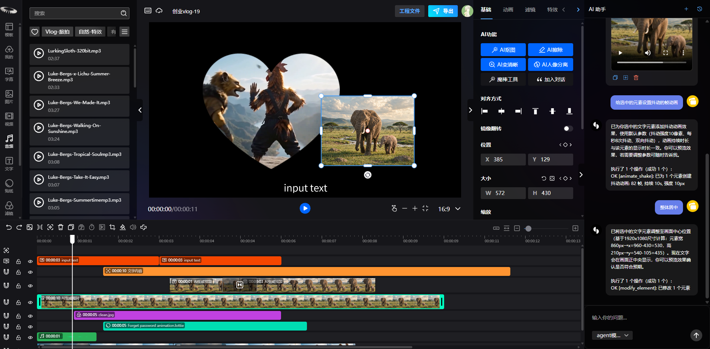

# unicut
AI-driven open-source video editing tool

# 无界云剪

体验地址：https://unicut.h5ds.com



相关技术参考文档：

React: [https://react.docschina.org/](https://react.docschina.org/)

semi-ui: [https://semi.design/](https://semi.design/)

Mobx: [https://cn.mobx.js.org/](https://cn.mobx.js.org/)

vite: [https://vitejs.cn/guide/](https://vitejs.cn/guide/)


# 项目源码说明

# 目录结构说明：

```
src/
├── assets/                        # 静态资源（图片、logo等）
├── components/                    # 公共组件
│   ├── audio/                     # 音频播放组件
│   ├── content/                   # 素材内容面板（图片/视频分割、文件夹、资源列表）
│   ├── content-user/              # 用户素材内容面板
│   ├── folder-guard/              # 文件夹组件
│   ├── footer/                    # 页脚
│   ├── header/                    # 顶部导航（含用户信息）
│   ├── login/                     # 登录/注册（邮箱、手机、二维码登录）
│   ├── not-found/                 # 404页面
│   ├── page-loading/              # 页面加载
│   ├── sub-header/                # 子导航
│   └── water-full/                # 瀑布流布局
├── config/                        # 配置（SDK类型定义、初始化数据）
├── database/                      # 本地数据库（IndexedDB）
├── hooks/                         # 自定义Hooks
├── language/                      # 国际化（中/英文）
├── layout/                        # 页面布局
│   ├── agreement-layout/          # 协议页布局
│   ├── home-layout/               # 首页布局
│   ├── index-layout/              # 入口页布局
│   ├── user-layout/               # 用户中心布局
│   └── workspace-layout/          # 工作区布局
├── less/                          # 全局样式变量
├── pages/                         # 页面模块
│   ├── aboutus/                   # 关于我们
│   ├── agreement/                 # 协议页（用户协议、隐私政策、VIP服务）
│   ├── editor/                    # 编辑器（核心模块）
│   │   ├── common/                # 编辑器通用组件（拖拽、加载、排序、资源面板）
│   │   ├── components/            # 编辑器子组件
│   │   │   ├── ai-chat/           # AI对话
│   │   │   ├── canvas/            # 画布（播放器、右键菜单、动画路径）
│   │   │   ├── header/            # 编辑器顶栏（导出、项目、用户、键盘快捷键）
│   │   │   ├── options/           # 属性面板（动画、滤镜、蒙版、抠图等）
│   │   │   ├── replace-tpl/       # 替换模板
│   │   │   ├── sidebar/           # 侧边栏
│   │   │   ├── sources/           # 素材面板（AI素材、音频、字幕、特效、图片、文字、视频等）
│   │   │   └── timeline2/         # 时间轴（轨道、工具栏：抠图/橡皮擦/裁剪等AI工具）
│   │   └── tools/                 # 工具函数（音频波形、上传处理）
│   ├── home/                      # 首页
│   ├── user/                      # 用户中心（账号、消息）
│   └── workspace/                 # 工作区（草稿、素材、作品管理）
├── server/                        # API服务层
├── services/                      # 客户端服务（本地存储）
├── stores/                        # 状态管理（Mobx：编辑器、用户、布局、音频）
├── theme/                         # 主题系统（亮色/暗色）
├── utils/                         # 工具函数（鉴权、加解密、导出、日志上报、事件总线）
├── App.tsx                        # 应用根组件
├── main.tsx                       # 应用入口
└── routes.config.ts               # 路由配置
```

# 项目开发说明：

当前目录执行yarn dev,启动开发环境（备注：如果没有在最外层执行过一次yarn install, 需要先在最外层执行以上命令，然后才可以在目录下执行yarn dev启动命令）


# 项目单独发布打包命令：


# 打包：
当前目录下执行：yarn build（备注：如果没有在最外层执行过一次yarn install和yarn build, 需要先在最外层执行以上两个命令，然后才可以单独对video-web执行yarn build打包）

执行结束后会在根目录下生成www文件目录，里面是生成的需要发布的文件

打包后目录结构说明：
-assets 公共资源
-homeAssets web系统资源
-index.html 首页

