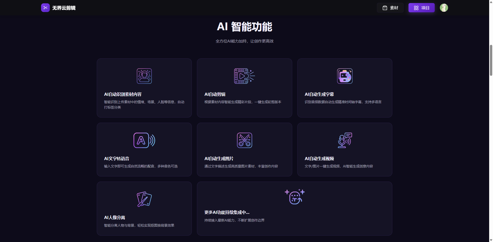

# 酒香也怕巷子深，好的产品值得让大家知道

做开源最怕什么？不是代码写不好，而是写出来了没人知道。

无界云剪（unicut）就是这样一款产品——功能对标剪映，开源免费，AI 加持，浏览器打开即用。但如果你没听过它，我一点也不意外。在这个信息爆炸的时代，好产品被淹没太正常了。

所以今天这篇文章，就是想让你知道：**有一款这样的工具，它真的值得被看见。**

### 编辑器界面

## 它是什么？

[无界云剪](https://unicut.h5ds.com/) 是一款 **AI 驱动的开源视频剪辑工具**。B/S 架构，不需要安装任何软件，打开浏览器就能用。目前全网 B/S 剪辑工具里功能最齐全的，没有之一。

这不是一个概念 Demo，是一个实际可用、功能完整的工具。

## 它能做什么？

### 元素类型

视频、图片、花字、音频、特效、贴纸（Lottie）、滤镜、镜头、字幕、二维码、图表（开发中）……支持的类型足够丰富，还开放扩展。

### 动画系统

Lottie 动画、转场动画、关键帧动画、元素动画、逐字动画、遮罩动画——专业剪辑需要的动画能力都有。

### 视觉效果

LUT 滤镜、基础滤镜、绿幕抠图、WebGL 特效、叠加模式、缩放旋转位移透明度镜像翻转、视频变速、音频变速、文字效果。

### 抠图

钢笔工具抠图、魔棒抠图、AI 抠图、裁剪抠图，多种方式任选。

### 素材库

视频模板、图片素材、花字素材、转场素材、音频素材、贴纸素材、滤镜素材、特效素材，素材齐全。

## AI 全流程加持

| 功能          | 费用 |
| ----------- | -- |
| AI 自动识别素材内容 | 免费 |
| AI 自动剪辑     | 免费 |
| AI 人像分离     | 免费 |
| AI 图像变清晰    | 免费 |
| AI 涂抹       | 免费 |
| AI 抠图       | 免费 |
| AI 视频轨迹追踪   | 免费 |
| AI 生成字幕     | 收费 |
| AI 文字转语音    | 收费 |
| AI 自动生成图片   | 收费 |
| AI 自动生成视频   | 收费 |

7 项免费 AI 功能，这在同类产品中极为少见。

## 专业时间轴

- 元素分割裁剪
- 批量操作选择 / 拖动
- 帧图预览 / 音波预览
- 多轨道编辑
- 隐藏 / 锁定 / 吸附
- 时间轴缩放
- 撤销 / 重做
- 定格元素
- 元素尺寸裁剪
- 视频时间裁剪

## 开源 & 商用

采用 **Apache License 2.0 改版**：

- **个人用户：完全免费**
- **多租户商用：商业授权**

相比于剪映等闭源工具，你可以完全掌控代码，私有化部署，自定义扩展。

## 地址汇总

| 项目     | 地址                                   |
| ------ | ------------------------------------ |
| 在线体验   | <https://unicut.h5ds.com/>           |
| GitHub | <https://github.com/mtsee/unicut>    |
| Gitee  | <https://gitee.com/676015863/unicut> |

***

酒香也怕巷子深。如果你觉得这个项目不错，点个 Star、帮忙转发，就是对我们最大的支持。好的产品，值得被更多人看见。
